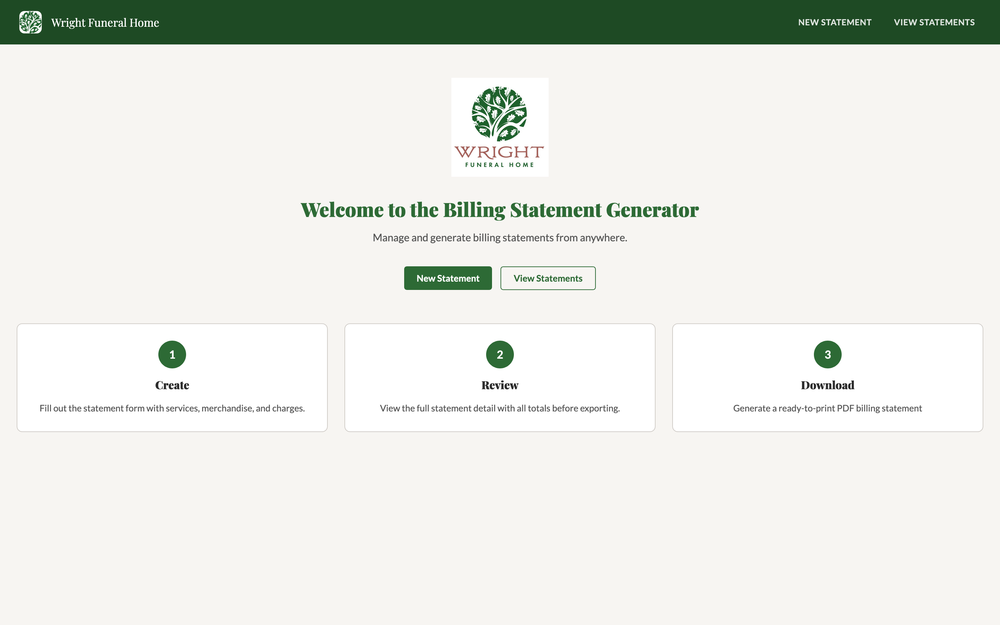

  # Wright Funeral Home Billing Statement Generator
  
  
  
  
  
  
  
  
  
  A full-stack billing statement generator for funeral homes — build itemized statements, apply service packages, and export professional PDF invoices.
  
  
  
  ## Live Demo
  
  **[https://wfh-billing-git-beta2.vercel.app/](https://wfh-billing-git-beta2.vercel.app/)**
  
  > Currently in beta. No account required — browse freely.
  
  ## Repositories
  
  | Repo | Description | Stack |
  |------|-------------|-------|
  | [wfh-billing-api](https://github.com/RyPalm04/wfh-billing-api) | REST API | Spring Boot 3.5, PostgreSQL, Cloud Run |
  | [wfh-billing-web](https://github.com/RyPalm04/wfh-billing-web) | Web frontend | React 19, Vite, Vercel | 
  | [wfh-billing-desktop](https://github.com/RyPalm04/wfh-billing-desktop) | Desktop app | JavaFX, jpackage |
  
  ## Architecture
  
  The web app and desktop app share a single REST API backed by a PostgreSQL database on Google Cloud Run. Statement line items are stored as JSONB snapshots — preserving name
  and price at the time of save regardless of future catalog changes. PDF generation runs server-side via JasperReports.

  The React web app and JavaFX desktop app both communicate with the Spring Boot API over HTTP. The API handles all business logic, database persistence, and PDF generation.
  
  ## Features

  - Build itemized statements across services, merchandise, special charges, and cash advances
  - Apply service packages with per-item inclusion tracking
  - Sales tax calculation with configurable rate
  - Server-side PDF export with professional layout
  - Full statement history with edit and delete
  
  ## Roadmap
  
  Multi-tenant SaaS — see [Epic #39](https://github.com/RyPalm04/wfh-billing/issues/39).
  
  ## License

  Proprietary. Source is visible for portfolio purposes. Commercial use, redistribution, or derivative works require written permission. See [LICENSE](LICENSE).
