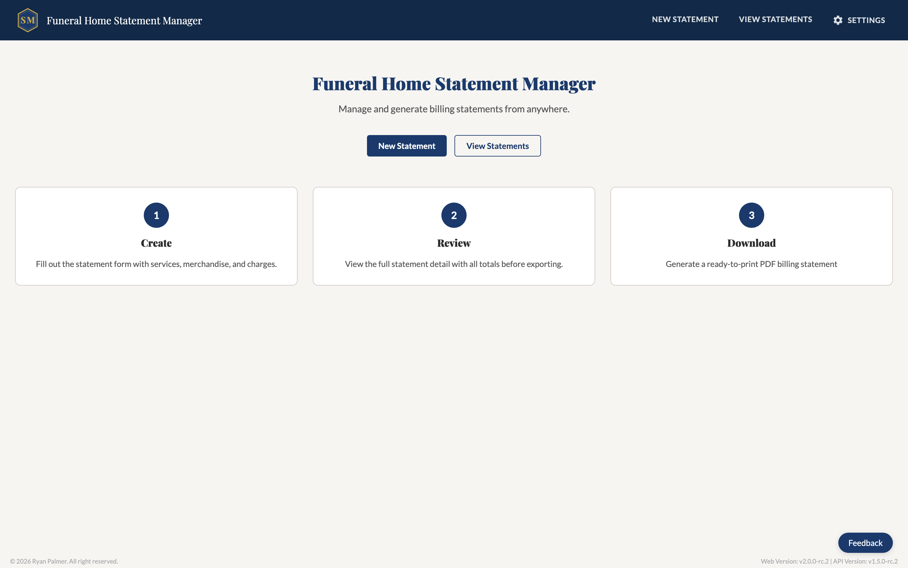
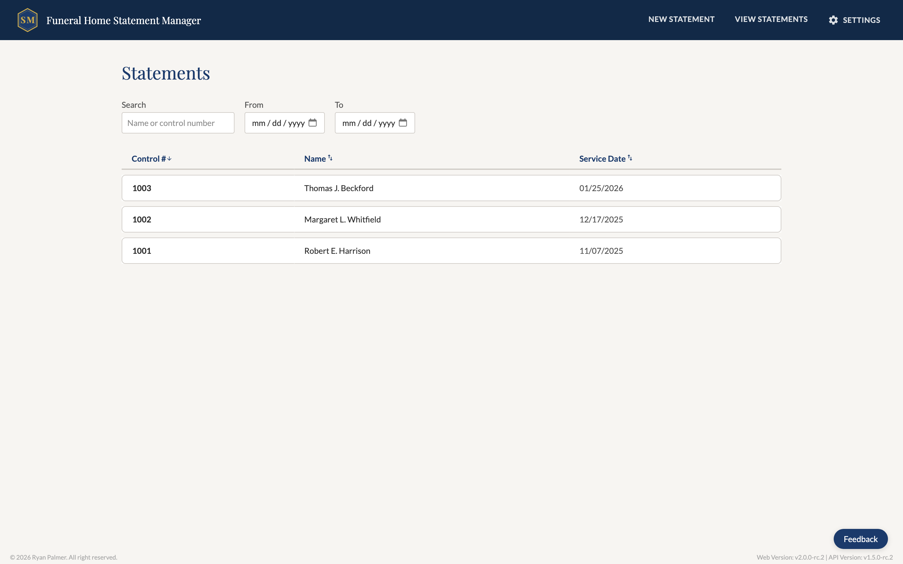
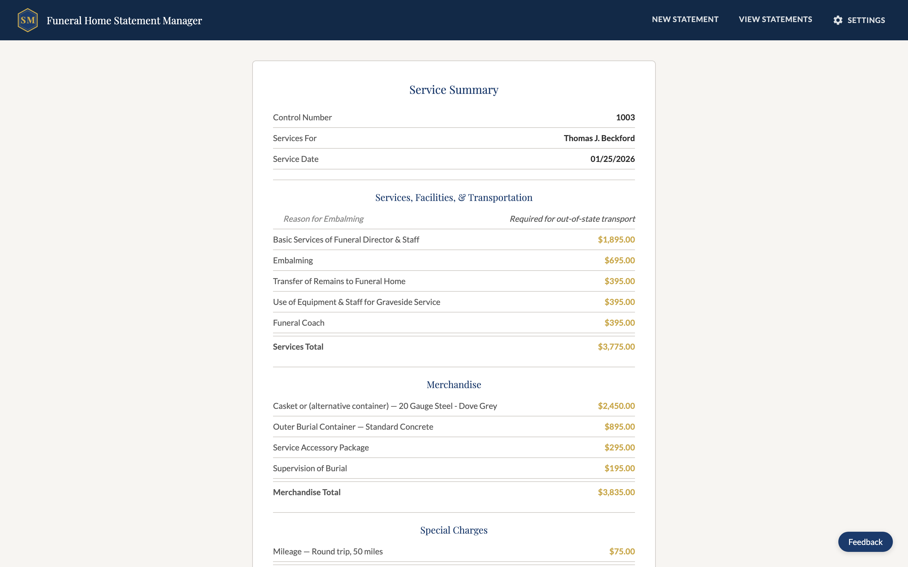

# Eternatel – Deathcare CMS

Full-stack billing platform for independent funeral homes — build itemized statements, apply service packages, and export professional PDF invoices. Available as a React web app and a native JavaFX desktop app sharing a single Spring Boot API.

  
  

> **Note:** The live demo reflects v2.0.0 branding ("Funeral Home Statement Manager"). The Eternatel rebrand rolls out with v3.0.0.

## Live Demo

**[https://wfh-billing-git-rc2.vercel.app/](https://wfh-billing-git-rc2.vercel.app/)**

> Stable v2.0.0 release. No account required — browse freely.

## Repositories

| Repo | Description | Stack |
|------|-------------|-------|
| [wfh-billing-api](https://github.com/RyPalm04/wfh-billing-api) | REST API | Spring Boot 3.5, PostgreSQL, Cloud Run |
| [wfh-billing-web](https://github.com/RyPalm04/wfh-billing-web) | Web frontend | React 19, Vite, Vercel |
| [wfh-billing-desktop](https://github.com/RyPalm04/wfh-billing-desktop) | Desktop app | JavaFX 21, jpackage |

## Architecture

A React web app and a JavaFX native desktop app share a single Spring Boot REST API backed by
PostgreSQL on Google Cloud Run. All business logic, database persistence, and PDF generation
live in the API — both clients communicate over HTTP.

**Multi-tenancy:** Data is tenant-scoped at the database level. Stripe webhooks drive
automated tenant provisioning — a new subscription triggers tenant creation, catalog seeding,
and license key generation in a single transaction.

**Authentication:** Web users authenticate via Supabase JWT validated on every request.
The desktop app authenticates using a persistent formatted license key generated at subscription
time, sent as a request header and validated by a dedicated Spring Security filter.

**Statement data:** Line items are stored as JSONB snapshots, preserving catalog name and price
at the time of save regardless of future catalog changes.

## Features

- Itemized billing statements across services, merchandise, special charges, and cash advances
- Service packages with per-item inclusion tracking and legacy package support
- Configurable sales tax rate with server-side calculation
- Server-side PDF export via JasperReports with professional layout
- Full statement history with save, edit, and delete
- Native desktop app (Windows/macOS) packaged with jpackage, sharing the same API as the web app
- Stripe subscription billing with automated tenant provisioning via webhook
- Multi-tenant SaaS architecture with per-tenant data isolation
- Desktop license key authentication generated on subscription and validated per-request
- Feedback system integrated across both clients

## Roadmap

| Version | Target | Focus |
|---------|--------|-------|
| v2.0.0 | June 2026 | Stable beta — web + desktop, full statement lifecycle |
| v3.0.0 | November 2026 | Commercial launch — multi-location, session security, password reset |
| v4.0.0 | March 2027 | Reporting, statement finalization, PDF archiving |

## License

Proprietary. Source is visible for portfolio purposes. Commercial use, redistribution, or
derivative works require written permission. See [LICENSE](LICENSE).
